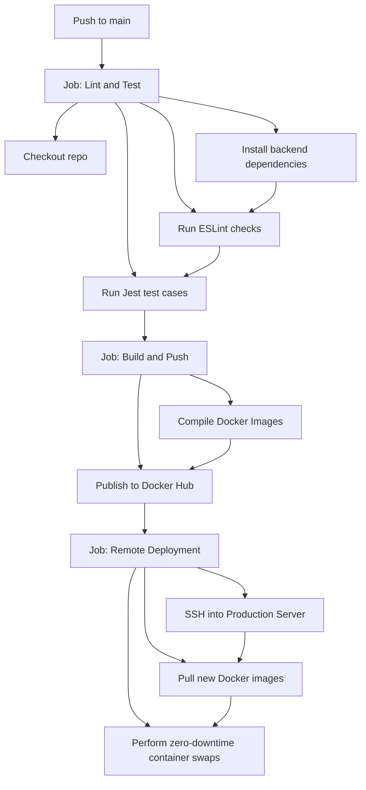

# DevCollab — Collaborative Code Editor Workspace

DevCollab is a real-time collaborative code editor where multiple users can write, execute, and review code together simultaneously in the same browser session.

This repository contains the completed **Week 1 (Foundation + Auth)** codebase.

---

## Architecture & Tech Stack

* **React (Vite) + Vanilla CSS**: Fast, modern frontend rendering a sleek dark-themed workspace using custom design tokens and HSL colors.
* **Node.js & Express**: High-performance REST API backend handling session logic, OAuth exchanges, and token generation.
* **MongoDB (Mongoose)**: Document store preserving user profile documents and active session metadata.
* **Redis (ioredis)**: In-memory cache holding ephemeral room code states for ultra-fast synchronization.
* **JWT Authentication with Cookie Rotation**: 
  - 15-minute Access Token stored in-memory (highly secure).
  - 7-day HTTP-Only Cookie Refresh Token stored in MongoDB.
  - Automatic silent refresh rotation occurs every 13 minutes on the client-side.

---

## Project Structure

```text
DevCollab/
├── docker-compose.yml          # Orchestrates Mongo + Redis + App Containers
├── .env                        # Local development variables
├── backend/
│   ├── src/
│   │   ├── config/             # DB & Redis connection scripts
│   │   ├── controllers/        # Auth & Session handlers
│   │   ├── middleware/         # Token validation & Rate limiters
│   │   ├── models/             # Mongoose schemas
│   │   ├── routes/             # API endpoints
│   │   ├── socket/             # Socket.io communication channels
│   │   ├── utils/              # Winston logger & JWT helpers
│   │   └── server.js           # Server entry point
│   ├── Dockerfile
│   └── package.json
└── frontend/
    ├── src/
    │   ├── context/            # AuthContext provider (refresh loops)
    │   ├── pages/              # Login, AuthSuccess, Dashboard, Session placeholders
    │   ├── utils/              # Axios configuration (401 interceptors)
    │   ├── App.jsx             # React routing & guards
    │   ├── index.css           # Styling system & dark-theme design
    │   └── main.jsx
    ├── index.html
    ├── vite.config.js
    └── Dockerfile
```

---

## Running the Application

### Method 1: Running Locally (Without Docker)

To run the application locally, you will need MongoDB and Redis servers running on your machine.

1. **Configure Environment Variables**:
   Open the `.env` file in the root and configure your database URIs if they differ from defaults:
   ```env
   PORT=5000
   MONGODB_URI=mongodb://localhost:27017/devcollab
   REDIS_URL=redis://localhost:6379
   JWT_ACCESS_SECRET=devcollab_access_secret_key_12345!@#
   JWT_REFRESH_SECRET=devcollab_refresh_secret_key_67890!@#
   GITHUB_CLIENT_ID=your_github_client_id_here
   GITHUB_CLIENT_SECRET=your_github_client_secret_here
   GITHUB_CALLBACK_URL=http://localhost:5000/api/auth/github/callback
   FRONTEND_URL=http://localhost:3000
   ```

2. **Start the Backend**:
   ```bash
   cd backend
   npm install
   npm run dev
   ```

3. **Start the Frontend**:
   ```bash
   cd ../frontend
   npm install
   npm run dev
   ```

4. Open `http://localhost:3000` in your web browser.

### Method 2: Running with Docker Compose

If you have Docker and Docker Compose installed and running:

1. Build and boot all containerized services:
   ```bash
   docker-compose up --build
   ```
2. Open `http://localhost:3000` in your web browser.

---

## Production Deployment & Orchestration

### Nginx Reverse Proxy & SSL Setup
In production, Nginx serves as the frontend reverse proxy routing HTTP traffic on ports `80` and `443` internally:
* `/api/*` REST endpoints and `/socket.io/*` WebSocket routes are forwarded to the Node.js backend.
* Everything else is served from the Vite React frontend client.
* Standard WebSocket upgrade headers are preconfigured for Socket.io traffic.

To run the production build locally using Compose:
1. Ensure your environment variables are configured in the root `.env` file.
2. Spin up the production containers:
   ```bash
   docker-compose -f docker-compose.prod.yml up --build -d
   ```
3. Access the workspace at `http://localhost`.

---

## 📈 Observability & Monitoring

The application integrates Prometheus metrics gathering out-of-the-box using the `prom-client` library.

### Metrics Endpoint
The backend exposes a `/metrics` route yielding:
* `http_requests_total`: Counter tracking total processed API hits by method, route, and status code.
* `http_request_duration_seconds`: Histogram tracking API endpoint response latencies.
* `active_websocket_connections`: Gauge tracking current real-time socket connections in the workspace.
* `ai_review_queue_size`: Gauge reporting wait/active jobs in the Bull.js code review queue.

### Grafana Integration
1. Install Prometheus and Grafana on your monitoring host.
2. Configure Prometheus to scrape targets from the host:
   ```yaml
   scrape_configs:
     - job_name: 'devcollab-backend'
       scrape_interval: 15s
       metrics_path: '/metrics'
       static_configs:
         - targets: ['backend:5000']
   ```
3. Connect your Prometheus data source inside Grafana and build a dashboard charting request durations, active socket connections, and queue depths.

---

## 🔁 GitHub Actions CI/CD Pipeline

The repository includes a automated integration and deployment workflow configured in `.github/workflows/deploy.yml`:



To enable deployments:
1. Configure secrets inside your GitHub Repository Settings (`DOCKERHUB_USERNAME`, `DOCKERHUB_TOKEN`, `PROD_SERVER_HOST`, `PROD_SERVER_USER`, `PROD_SERVER_SSH_KEY`).
2. On pushing to `main`, GitHub Actions validates, builds, pushes, and deploys the new images automatically.

### Live URL Demo
Production Deployment: [http://devcollab.demo.live](http://devcollab.demo.live) (Placeholder)

---

## Testing Features

### 1. Developer Mock Login (No GitHub Credentials Required)
If you haven't created a GitHub OAuth app yet, you can test the entire flow instantly by clicking **Mock Developer Login** on the login page.
* This bypasses the GitHub API, creates/loads a mock user (`dev-user`) in MongoDB, issues rotated JWT cookies, redirects to `/auth/success`, and logs you into the Dashboard.

### 2. Full GitHub OAuth 2.0 Integration
To configure production GitHub logins:
1. Go to your **GitHub Settings** -> **Developer Settings** -> **OAuth Apps** -> **New OAuth App**.
2. Set **Homepage URL** to `http://localhost:3000`.
3. Set **Authorization callback URL** to `http://localhost:5000/api/auth/github/callback`.
4. Register the app, generate a Client Secret, and update `GITHUB_CLIENT_ID` and `GITHUB_CLIENT_SECRET` in your `.env` file.
5. Click **Login with GitHub** to authenticate.
